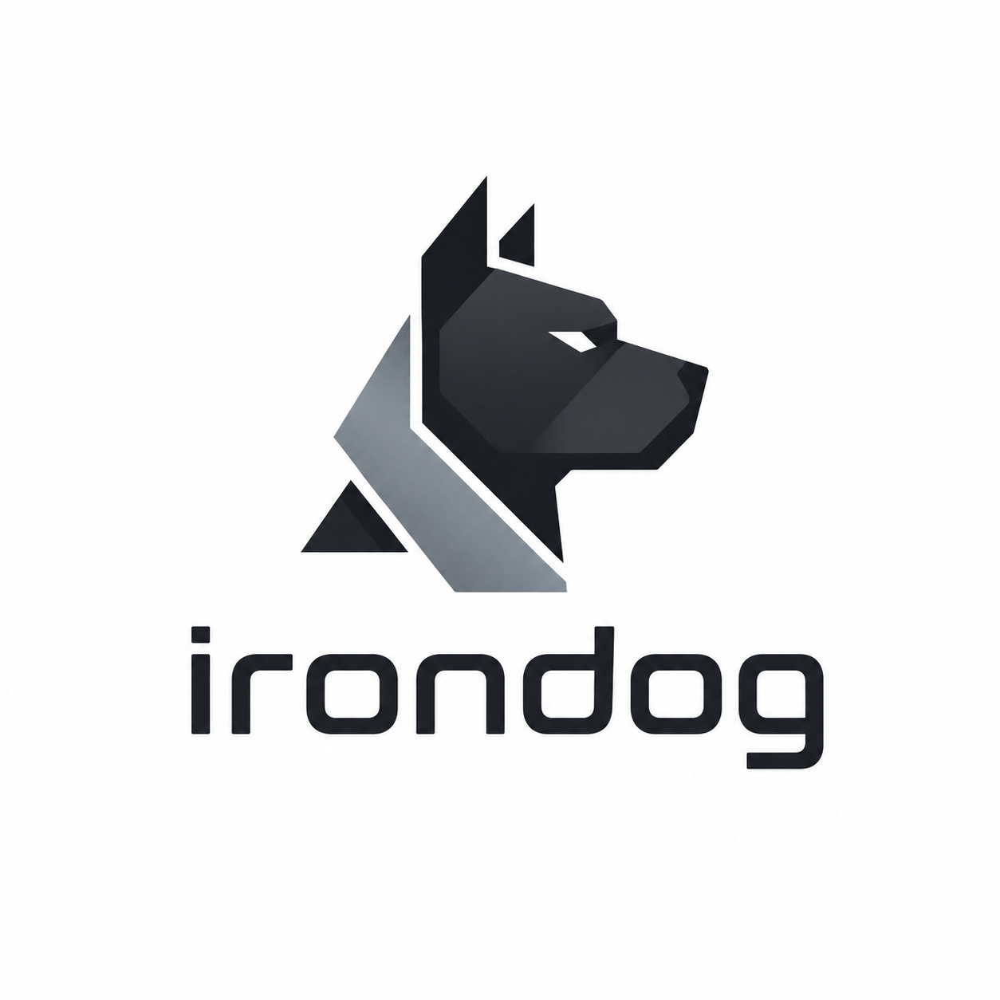

<p align="center">
  
</p>

# IronDog

A mobile app for tracking weightlifting and bodybuilding workouts. Built for hypertrophy and progressive overload.

## Features

- Start a workout for the current day
- Exercises organized by muscle group (chest, shoulders, back, arms, legs)
- Track sets, weight, reps, and failure status
- Weight recommendations based on previous sessions

## Tech Stack

- Expo SDK 54
- React Native 0.81
- TypeScript
- Tamagui UI
- Express (mock API)

## Getting Started

```bash
npm install
npm run server   # Start mock API on port 3001
npm start        # Start Expo app
```
